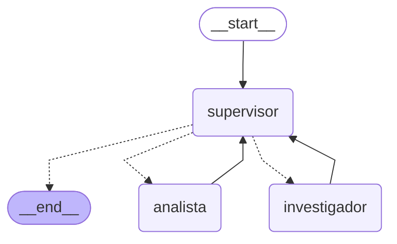

# Pre-entrega 6 — Orquestador multi-agente especializado

Prototipo de un **Orquestador Multi-Agente de Análisis e Investigación**
construido con LangGraph: un nodo `Supervisor` (topología jerárquica)
delega dinámicamente entre dos agentes especialistas — un **Investigador**
(busca información externa) y un **Analista** (procesa esos datos:
sentimiento y métricas numéricas) — y decide, con salida estructurada, si
la tarea ya está resuelta o si algún especialista tiene que refinar su
resultado antes de responder.

## Qué hace (ejemplo de consulta)

> "Investigá las opiniones sobre el lanzamiento del auricular Aurora X2,
> analizá el sentimiento general y el promedio de las calificaciones, y
> dame un resumen."

Esta consulta obliga a los dos dominios de especialización (investigación
+ análisis) y dispara, además, un ciclo de refinamiento real: el Analista
puede resolver primero solo el sentimiento, el Supervisor detecta que
faltó el promedio numérico que pedía el usuario, y lo manda de vuelta al
Analista con una instrucción puntual antes de cerrar con una síntesis
final. Ver `trace_ejemplo.json` para la traza completa de esta corrida.

## Topología y por qué la elegí

Elegí una **topología jerárquica centralizada** (Supervisor-especialistas)
en vez de, por ejemplo, un grafo peer-to-peer donde los agentes se pasaran
el control entre sí directamente. Con solo dos especialistas y un problema
que siempre necesita "investigar, después analizar, posiblemente refinar",
un router central que:

- concentra TODA la lógica de "¿quién sigue?" y "¿esto ya alcanza?" en un
  solo lugar (más fácil de razonar, debuggear y loguear que lógica de
  ruteo distribuida entre agentes que no se ven entre sí),
- vuelve a pasar por el Supervisor después de CADA especialista (nunca un
  especialista decide por su cuenta pasarle la posta a otro), así el
  Supervisor puede aplicar su rúbrica de suficiencia en cada paso, y
- es la que compone mejor con `Literal` + salida estructurada para las
  aristas condicionales, tal como pide el enunciado,

es la opción más simple que cumple los cuatro requerimientos técnicos sin
sobre-ingeniería. El costo de esta topología es que el Supervisor es un
cuello de botella y un punto único de fallo en el ruteo — mitigado acá con
el límite duro de pasos (`MAX_PASOS_SUPERVISOR`) y con que su prompt tiene
una rúbrica explícita, no ambigua, de cuándo dar por terminada la tarea.

### Cómo se manejan los conflictos entre agentes

No hay comunicación directa entre el Investigador y el Analista — nunca
se "pisan" ni negocian entre ellos. Toda coordinación pasa por:

1. **`contribuciones`** (el Estado Compartido Estructurado): cada aporte
   queda registrado como `{"agente": ..., "contenido": ...}`, en orden,
   sin sobreescribirse (reducer `operator.add`). El Supervisor lee esto —
   no el historial crudo de mensajes — para decidir el próximo paso, así
   que siempre sabe con precisión qué aportó cada uno.
2. **La rúbrica del Supervisor** (ver `supervisor.py`) es el único árbitro
   de "¿esto es suficiente o hay que refinar?". Si el Analista entrega
   algo incompleto, el "conflicto" no se resuelve entre agentes: el
   Supervisor simplemente lo vuelve a mandar al mismo especialista con una
   instrucción puntual de qué le faltó.
3. **Contexto acotado por especialista**: cada especialista recibe SOLO
   la instrucción puntual del Supervisor (más, el Analista, el último
   hallazgo del Investigador) — nunca el historial completo de mensajes
   del sistema (ver `_instruccion_para_especialista` en `graph.py`). Esto
   evita la "Contaminación de Contexto" que menciona el enunciado: ningún
   especialista tiene que leer/descartar metadata de decisiones internas
   del Supervisor o del otro especialista.

## Diagrama del grafo

`graph.get_graph().draw_mermaid_png()` necesita salir a internet (llama a
mermaid.ink) o tener un navegador headless instalado — para que el repo
funcione sin esa dependencia, generé el diagrama con el equivalente
offline, `graph.get_graph().draw_mermaid()` (texto Mermaid puro, sin red),
que GitHub renderea igual:



Para regenerarlo vos mismo (por si cambiás el grafo):

```bash
python -c "from graph import construir_grafo; print(construir_grafo().compile().get_graph().draw_mermaid())"
```

Si preferís el PNG real (`draw_mermaid_png()`), funciona igual siempre que
tengas salida a internet: `construir_grafo().compile().get_graph().draw_mermaid_png()`
devuelve los bytes del PNG.

## Arquitectura

- **`state.py`**: `EstadoOrquestador` (hereda de `MessagesState`) +
  `next_agent` (`Literal["investigador","analista","FINISH"]`),
  `contribuciones` (reducer `operator.add`), `tarea_completada`,
  `pasos_dados`.
- **`supervisor.py`**: el nodo Supervisor. Usa
  `llm.with_structured_output(DecisionSupervisor)` — un modelo Pydantic
  cuyo campo `siguiente` es el mismo `Literal` del estado — así la arista
  condicional nunca puede recibir un valor inválido. Antes de consultar al
  LLM, chequea `pasos_dados >= MAX_PASOS_SUPERVISOR` y si se llegó al
  límite, fuerza `FINISH` sin gastar ni una llamada más (defensa contra el
  "Supervisor Infinito").
- **`agents/research_agent.py`** / **`agents/analyst_agent.py`**: cada uno
  arma su propio sub-agente ReAct con `create_react_agent` (vía
  `agents/_compat.py`, que cae a `langchain.agents.create_agent` si una
  versión futura de LangGraph elimina el `create_react_agent` clásico —
  ya viene deprecated desde LangGraph 1.x) y herramientas acotadas:
  - Investigador: `buscar_informacion` (`tools/busqueda.py`).
  - Analista: `analizar_sentimiento` y `calcular_metricas`
    (`tools/analisis.py`).
- **`graph.py`**: arma el `StateGraph`, envuelve cada sub-agente ReAct en
  un nodo que traduce su resultado al estado compartido (agrega a
  `contribuciones` y a `messages`), y define
  `enrutar_desde_supervisor(estado) -> Literal["investigador","analista","__end__"]`
  como arista condicional desde "supervisor".
- **`tools/`**: `buscar_informacion` (búsqueda simulada sobre un corpus
  propio de reseñas; o Tavily real si configurás `SEARCH_PROVIDER=tavily`
  + `TAVILY_API_KEY`), `analizar_sentimiento` (léxico, offline),
  `calcular_metricas` (estadística básica).

### Nota sobre los dos `recursion_limit` (por qué hay dos, no uno)

Al probar esto con un LLM real (no el determinístico de `demo_offline.py`)
apareció un `GraphRecursionError` real: LangGraph le propaga el
`recursion_limit` del grafo PRINCIPAL a los sub-agentes ReAct de cada
especialista cuando se invocan sin un config propio. Con un LLM real —
que puede necesitar varias idas y vueltas de tool-calling antes de
responder, a diferencia del guion fijo del LLM de prueba — eso significa
que los pasos internos de UN especialista se descuentan del mismo
presupuesto que el Supervisor, y un especialista que tarda de más puede
agotarlo por completo antes de que el Supervisor llegue siquiera a tomar
su segunda decisión.

La solución (ya aplicada en `graph.py`, función
`_invocar_especialista_acotado`): cada especialista se invoca con SU
PROPIO `recursion_limit` (`AGENTE_RECURSION_LIMIT`, config independiente
del `RECURSION_LIMIT` del grafo principal), y si aun así se queda sin
pasos, en vez de dejar que la excepción tumbe todo el proceso, se atrapa
y se convierte en una contribución explícita de "no pude completar la
tarea" — que el Supervisor lee como información incompleta y, según su
propia rúbrica, decide si reintenta con otra instrucción o cierra
explicando la limitación, en vez de que todo el orquestador reviente. Ver
`tests/test_resiliencia_especialista.py` para la prueba de esto.

## Requisitos

- Python 3.12+
- Una API key gratuita de [Groq](https://console.groq.com/keys) (la misma
  que ya venís usando en las pre-entregas anteriores te sirve tal cual).

## Instalación

```bash
python3.12 -m venv .venv
source .venv/bin/activate        # en Windows: .venv\Scripts\activate

pip install -r requirements.txt

cp .env.example .env
# Editá .env y completá GROQ_API_KEY con tu key real.
```

## Cómo probarlo

### 1. Uso rápido desde la terminal (LLM real)

```bash
python main.py "Investigá las opiniones sobre el lanzamiento del auricular Aurora X2, analizá el sentimiento general y el promedio de las calificaciones, y dame un resumen."
```

Imprime cada contribución (investigador, analista, y las decisiones del
supervisor) en orden, y cuántos pasos usó el Supervisor.

(.venv) lfucc@MacBook-Air-2 preentrega-6-Orquestador-multi-agente-especializado % python main.py "Investigá las opiniones sobre el lanzamiento del auricular Aurora X2, analizá el sentimiento general y el promedio de las calificaciones, y dame un resumen."
2026-09-26 19:18:58,632 | INFO     | HTTP Request: POST https://api.groq.com/openai/v1/chat/completions "HTTP/1.1 200 OK"
2026-09-26 19:18:59,399 | INFO     | HTTP Request: POST https://api.groq.com/openai/v1/chat/completions "HTTP/1.1 200 OK"
2026-09-26 19:19:00,356 | INFO     | HTTP Request: POST https://api.groq.com/openai/v1/chat/completions "HTTP/1.1 200 OK"
2026-09-26 19:19:00,863 | INFO     | HTTP Request: POST https://api.groq.com/openai/v1/chat/completions "HTTP/1.1 200 OK"
2026-09-26 19:19:01,437 | INFO     | HTTP Request: POST https://api.groq.com/openai/v1/chat/completions "HTTP/1.1 200 OK"
2026-09-26 19:19:01,971 | INFO     | HTTP Request: POST https://api.groq.com/openai/v1/chat/completions "HTTP/1.1 200 OK"
2026-09-26 19:19:03,654 | INFO     | HTTP Request: POST https://api.groq.com/openai/v1/chat/completions "HTTP/1.1 200 OK"
2026-09-26 19:19:04,504 | INFO     | HTTP Request: POST https://api.groq.com/openai/v1/chat/completions "HTTP/1.1 200 OK"
2026-09-26 19:19:05,360 | INFO     | HTTP Request: POST https://api.groq.com/openai/v1/chat/completions "HTTP/1.1 200 OK"
2026-09-26 19:19:06,759 | INFO     | HTTP Request: POST https://api.groq.com/openai/v1/chat/completions "HTTP/1.1 200 OK"
2026-09-26 19:19:07,166 | INFO     | HTTP Request: POST https://api.groq.com/openai/v1/chat/completions "HTTP/1.1 429 Too Many Requests"
2026-09-26 19:19:07,167 | INFO     | Retrying request to /openai/v1/chat/completions in 6.000000 seconds
2026-09-26 19:19:14,030 | INFO     | HTTP Request: POST https://api.groq.com/openai/v1/chat/completions "HTTP/1.1 200 OK"
2026-09-26 19:19:14,099 | INFO     | HTTP Request: POST https://api.groq.com/openai/v1/chat/completions "HTTP/1.1 429 Too Many Requests"
2026-09-26 19:19:14,100 | INFO     | Retrying request to /openai/v1/chat/completions in 9.000000 seconds
2026-09-26 19:19:23,661 | INFO     | HTTP Request: POST https://api.groq.com/openai/v1/chat/completions "HTTP/1.1 200 OK"
2026-09-26 19:19:23,732 | INFO     | HTTP Request: POST https://api.groq.com/openai/v1/chat/completions "HTTP/1.1 429 Too Many Requests"
2026-09-26 19:19:23,733 | INFO     | Retrying request to /openai/v1/chat/completions in 8.000000 seconds
2026-09-26 19:19:32,797 | INFO     | HTTP Request: POST https://api.groq.com/openai/v1/chat/completions "HTTP/1.1 200 OK"
2026-09-26 19:19:33,209 | INFO     | HTTP Request: POST https://api.groq.com/openai/v1/chat/completions "HTTP/1.1 429 Too Many Requests"
2026-09-26 19:19:33,210 | INFO     | Retrying request to /openai/v1/chat/completions in 10.000000 seconds
2026-09-26 19:19:44,256 | INFO     | HTTP Request: POST https://api.groq.com/openai/v1/chat/completions "HTTP/1.1 200 OK"

--- Contribuciones ---
[supervisor] Realiza una búsqueda en el corpus interno de reseñas y opiniones sobre el auricular 'Aurora X2' centrada en su lanzamiento. Obtén varios(hasta 5) fragmentos de reseñas que incluyan tanto texto de opinión como calificaciones numéricas (por ejemplo, estrellas o puntuación del 1 al 5).

[investigador] Sorry, need more steps to process this request.

[supervisor] Realiza una búsqueda en el corpus interno de reseñas y opiniones sobre el auricular 'Aurora X2' centrada en su lanzamiento. Obtén hasta 5 fragmentos de reseñas que incluyan tanto texto de opinión como calificaciones numéricas (por ejemplo, estrellas o puntuación del 1 al 5). Cada fragmento debe contener la valoración numérica y una breve cita del comentario.

[investigador] **Fragmentos de reseñas encontradas sobre el lanzamiento del auricular “Aurora X2”**

| # | Fuente | Calificación | Cita de la reseña |
|---|--------|--------------|-------------------|
| 1 | TiendaApp Reviews | **5 estrellas** | “El nuevo auricular Aurora X2 tiene un sonido excelente y la batería dura muchísimo más que el modelo anterior. **Totalmente recomendado**.” |
| 2 | Blog GadgetsHoy | **4 estrellas** | “Un lanzamiento sólido, con mejoras reales sobre la versión anterior, aunque el precio quedó un poco por encima de la competencia directa.” |

*Se han obtenido los dos fragmentos disponibles en el corpus interno que cumplen con los requisitos de incluir texto de opinión y una valoración numérica.*

[supervisor] Con los fragmentos de reseñas proporcionados (5 estrellas con comentario positivo y 4 estrellas con comentario mayormente positivo pero menciona precio), calcula el promedio de las calificaciones y determina el sentimiento general (positivo, neutro o negativo). Luego elabora un breve resumen que incluya el promedio de puntuación y una descripción del sentimiento general del lanzamiento del auricular Aurora X2.

[analista] **Resumen del lanzamiento del auricular Aurora X2**

- **Promedio de puntuación:** 4.5 estrellas (sobre 5).  
- **Sentimiento general:** **Positivo**.

Los dos fragmentos analizados destacan la calidad del sonido, la mayor duración de la batería y las mejoras respecto al modelo anterior, lo que genera una percepción claramente favorable. Incluso la reseña que menciona un precio algo elevado mantiene un tono mayormente positivo, reforzando la valoración global positiva del producto.

--- Respuesta final ---
Resumen final para el usuario: El lanzamiento del auricular Aurora X2 recibió dos reseñas en el corpus interno, con calificaciones de 5 y 4 estrellas, lo que da un promedio de 4.5 estrellas sobre 5. El sentimiento general es positivo, destacando la excelente calidad de sonido, mayor duración de batería y mejoras respecto al modelo anterior, aunque se menciona un precio algo elevado.

--- Pasos del Supervisor: 4 (completada) ---

### 2. Tests offline (sin API key, sin red)

```bash
pytest
```

Corre 15 tests: herramientas, selector de LLM, el nodo Supervisor (incluida
la defensa contra el bucle infinito), el ruteo completo del grafo —
incluyendo un test específico del ciclo de refinamiento y uno que verifica
que cada especialista recibe solo su instrucción puntual, no el historial
completo — y uno que reproduce el `recursion_limit` compartido con un
especialista "colgado" (ver la nota más arriba).

### 3. Traza de ejemplo ya incluida en el repo

`trace_ejemplo.json` ya viene generado y versionado: la salida real de
correr el grafo completo (`StateGraph`, `ToolNode` interno de cada
sub-agente ReAct, las tres herramientas) con LLMs **determinísticos** de
prueba (`demo_llm.py`) en los tres roles, para que el repo tenga evidencia
reproducible sin depender de ninguna API key. Incluye el recorrido
completo: supervisor → investigador → supervisor → analista (incompleto)
→ supervisor (pide refinar) → analista (refinado) → supervisor → FIN, con
los resultados REALES de cada herramienta (no inventados).

Para regenerarlo vos mismo:

```bash
python demo_offline.py
```

### 4. `demo_notebook.ipynb`: demo del flujo de delegación

Notebook ya ejecutado (con sus outputs guardados) que corre el mismo
escenario paso a paso y va mostrando, celda por celda, a quién delega el
Supervisor y por qué. Abrilo directo en GitHub para verlo sin instalar
nada, o corrélo vos con `jupyter notebook demo_notebook.ipynb`.

### 5. Traza con el LLM real (evidencia "de verdad")

```bash
python run_demo.py "tu consulta"   # o sin argumento, usa una por defecto
```

Corre el mismo escenario pero con el LLM real de tu `.env`, y escribe
`trace_real.json` (no se versiona — cada uno genera la suya). Con un LLM
real el recorrido puede variar (por ejemplo, el analista podría acertar a
la primera) — lo esperable es que el Supervisor pase por los dos
especialistas y cierre con `FINISH` antes del `recursion_limit`.

## Estructura del repo

```
state.py              # EstadoOrquestador (Estado Compartido Estructurado)
supervisor.py          # Nodo Supervisor + DecisionSupervisor (salida estructurada)
agents/
  research_agent.py    # Agente de Investigación (create_react_agent + buscar_informacion)
  analyst_agent.py      # Agente de Análisis (create_react_agent + analizar_sentimiento/calcular_metricas)
  _compat.py            # create_react_agent con fallback a langchain.agents.create_agent
tools/
  busqueda.py           # buscar_informacion (simulado o Tavily)
  analisis.py           # analizar_sentimiento, calcular_metricas
graph.py               # StateGraph completo + arista condicional del supervisor
demo_llm.py            # LLMs determinísticos de prueba (solo para demo_offline.py)
demo_offline.py        # genera trace_ejemplo.json (sin API key)
demo_notebook.ipynb    # notebook ejecutado, demo del flujo de delegación
run_demo.py            # genera trace_real.json (con tu API key real)
main.py                # uso rápido desde terminal
trace_ejemplo.json     # evidencia ya incluida en el repo
tests/                 # tests offline (pytest)
```

## Checklist de la consigna

- [x] Topología jerárquica: nodo `Supervisor` que rutea con salida
      estructurada (`Literal` en `DecisionSupervisor.siguiente`).
- [x] 2 agentes especialistas con `create_react_agent` y herramientas
      acotadas: Investigador (`buscar_informacion`), Analista
      (`analizar_sentimiento`, `calcular_metricas`).
- [x] Estado Compartido Estructurado (`EstadoOrquestador.contribuciones`,
      con reducer, rastrea qué agente aportó qué).
- [x] Flujo de Supervisión con refinamiento: el Supervisor puede volver a
      mandar al Analista con una instrucción puntual antes de `FINISH`
      (ver `trace_ejemplo.json` y `tests/test_graph_ruteo.py`).
- [x] `state.py`, `agents/` (investigación + análisis), grafo con nodo
      Supervisor, `README.md` con diagrama Mermaid.
- [x] `demo_notebook.ipynb` (+ `trace_ejemplo.json`) demostrando el flujo
      de delegación.
- [x] Contador de pasos (`MAX_PASOS_SUPERVISOR`) + `recursion_limit`
      contra el "Supervisor Infinito".
- [x] Contexto acotado por especialista (evita "Contaminación de
      Contexto").
- [x] `.env` fuera de git (`.gitignore`); `.env.example` como plantilla.

### Extra (no pedido explícitamente por el enunciado)

- Selector de LLM por variable de entorno (Groq gratis por defecto,
  OpenAI/Anthropic opcionales).
- Selector de búsqueda (`SEARCH_PROVIDER=simulado|tavily`): funciona sin
  ninguna key por defecto, y se puede activar Tavily real con una key.
- `demo_offline.py`: evidencia reproducible sin API key, además de
  `run_demo.py` con el LLM real.
- Tests del nodo Supervisor que verifican, específicamente, que el límite
  de pasos corta el bucle SIN llamar al LLM.
