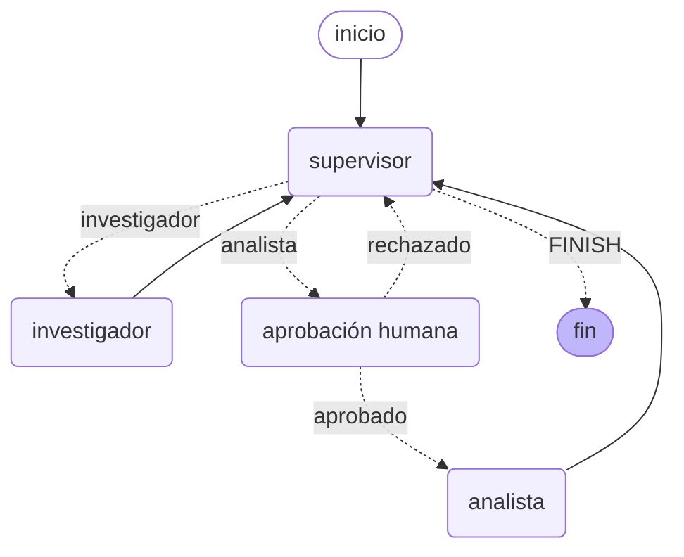

# Pre-entrega 7 — API de producción y monitoreo activo

API REST (FastAPI) que expone el orquestador multi-agente Supervisor /
Investigador / Analista de la **pre-entrega 6** como un servicio de
producción: jobs asíncronos que no bloquean, persistencia real en Redis
(tanto del estado del job como del checkpoint interno de LangGraph),
observabilidad activa (trazas de cada nodo/llamada al LLM) y un punto de
aprobación humana (Human-in-the-loop) antes de ejecutar la acción
"crítica" del flujo.

## Arquitectura

```
mi-api-agente/              (este repo)
├── app/
│   ├── main.py              # FastAPI: POST /tasks, GET /tasks/{id}, POST /tasks/{id}/approve
│   ├── worker.py             # corre el grafo en segundo plano, actualiza Redis (PENDING/RUNNING/.../FAILED)
│   ├── graph.py              # el orquestador del M6 + el nodo de aprobación humana
│   ├── hitl.py                # nodo de aprobación humana (interrupt())
│   ├── redis_checkpointer.py  # checkpointer de LangGraph respaldado por Redis (RedisSaver)
│   ├── redis_state.py         # estado del job (PENDING/RUNNING/AWAITING_APPROVAL/DONE/FAILED) en Redis
│   ├── observability.py       # init de Arize Phoenix o LangSmith
│   ├── demo_scenario.py       # LLMs de guion para correr todo sin API key (DEMO_MODE)
│   ├── config.py, llm.py, state.py, supervisor.py, demo_llm.py
│   ├── agents/                # Investigador y Analista (heredado del M6)
│   └── tools/                 # búsqueda simulada, análisis de sentimiento, métricas (heredado del M6)
├── tests/                    # 40 tests offline (pytest + fakeredis, sin API key)
├── scripts/
│   ├── demo_offline.py        # corre TODO el flujo (incluido HITL) contra un Redis real, sin API key
│   └── load_test.py           # dispara 5 pedidos concurrentes y mide latencia p50/p95
├── requirements.txt
├── docker-compose.yml         # Redis + Phoenix + la API
├── Dockerfile
├── .env.example
├── screenshots/               # evidencia: trazas + costo/p95 del dashboard (ver más abajo)
└── pytest.ini
```

### El grafo (heredado del M6, con el nodo de HITL agregado)



Antes de ejecutar al **analista** (modelado acá como la acción
crítica/costosa del sistema — en uno real sería la que tiene efectos
secundarios o mayor costo), el grafo pasa por `aprobacion_humana`, que
llama a `interrupt(...)` de LangGraph y se CONGELA ahí: la invocación en
curso devuelve de inmediato con una clave `__interrupt__`, sin excepción.
`app/worker.py` detecta eso, deja el job en Redis con status
`AWAITING_APPROVAL` y el payload de qué se quiere aprobar. El endpoint
`POST /tasks/{id}/approve` retoma el grafo EXACTAMENTE donde se frenó
(usando el checkpoint guardado en Redis), aprobando o rechazando.

### Por qué un `RedisSaver` propio y no `langgraph-checkpoint-redis`

El paquete oficial `langgraph-checkpoint-redis` necesita Redis Stack (los
módulos RedisJSON/RediSearch), no disponibles en una imagen `redis:7-alpine`
común. `app/redis_checkpointer.py` es un puerto directo del algoritmo de
`InMemorySaver` (la referencia oficial de LangGraph) que reemplaza los
`dict` en memoria por hashes de Redis — funciona con CUALQUIER Redis
estándar. Está probado (`tests/test_redis_checkpointer.py`) simulando
"reiniciar el proceso" (cliente y checkpointer Python completamente
nuevos apuntando al mismo Redis), que es exactamente lo que pasa entre
`POST /tasks` y `POST /tasks/{id}/approve` en la API real.

## 1. Instalación

```bash
git clone <tu-repo>
cd mi-api-agente
python3 -m venv .venv
source .venv/bin/activate        # Windows: .venv\Scripts\activate
pip install -r requirements.txt
cp .env.example .env
```

Completá `GROQ_API_KEY` en `.env` (gratis en
https://console.groq.com/keys) — o dejá `DEMO_MODE=true` como está por
default para probar todo el stack sin ninguna key (ver sección 3).

## 2. Levantar Redis y Phoenix

```bash
docker compose up -d redis phoenix
```

- Redis queda en `localhost:6379` (lo que ya apunta `REDIS_URL` del
  `.env.example`).
- El dashboard de Phoenix queda en **http://localhost:6006** (sin login,
  sin API key — es 100% gratis y self-hosted).

Si no querés usar Docker: instalá Redis localmente (`redis-server`) y
Phoenix con `pip install arize-phoenix && python -m phoenix.server.main serve`.

## 3. Levantar la API

```bash
uvicorn app.main:app --reload
```

Con `DEMO_MODE=true` (el default del `.env.example`) la API usa LLMs de
guion deterministas en vez de llamar a Groq — podés probar TODO el flujo
(jobs asíncronos, Redis, HITL) sin gastar nada ni necesitar ninguna key.
**Para la prueba de carga real (sección 6), poné `DEMO_MODE=false`** y
completá tu `GROQ_API_KEY`.

También podés correr `python scripts/demo_offline.py` (con Redis ya
levantado): hace el flujo completo por código, sin HTTP, y te deja un
`trace_demo_offline.json` con el detalle.

## 4. Probar los endpoints

```bash
# 1. Encolar una consulta -- responde al instante con el job_id
curl -X POST http://localhost:8000/tasks \
  -H "Content-Type: application/json" \
  -d '{"query": "Investigá las opiniones sobre el auricular Aurora X2 y dame el sentimiento general y el puntaje promedio."}'
# -> {"job_id": "...", "status": "PENDING"}

# 2. Consultar el estado (no bloquea)
curl http://localhost:8000/tasks/<job_id>
# -> status PENDING -> RUNNING -> (si hace falta) AWAITING_APPROVAL -> DONE

# 3. Si quedó en AWAITING_APPROVAL, aprobar (o rechazar) la acción crítica
curl -X POST http://localhost:8000/tasks/<job_id>/approve \
  -H "Content-Type: application/json" \
  -d '{"aprobado": true, "comentario": "dale, adelante"}'

# 4. Volver a consultar -- ahora debería decir DONE con el resultado final
curl http://localhost:8000/tasks/<job_id>
```

La documentación interactiva (Swagger) queda en
http://localhost:8000/docs.


## 5. Observabilidad

Con `OBSERVABILITY_PROVIDER=phoenix` (el default), cada llamada al LLM y
cada paso del grafo (supervisor, investigador, analista, el nodo de
aprobación humana, cada tool call) queda instrumentado automáticamente
vía OpenInference/OpenTelemetry — sin agregar ningún decorador a mano.
Las trazas aparecen en **http://localhost:6006** en tiempo real.

Para usar LangSmith en vez de Phoenix: `OBSERVABILITY_PROVIDER=langsmith`
y `LANGCHAIN_API_KEY=<tu key gratis de https://smith.langchain.com>` en
el `.env` — no hace falta tocar ningún código, LangChain manda las trazas
solo con esas variables de entorno seteadas.

## 6. Prueba de carga (5 pedidos concurrentes)

**Importante:** poné `DEMO_MODE=false` y una `GROQ_API_KEY` real en el
`.env` antes de este paso — si no, la latencia y el costo que vas a
capturar en el dashboard no van a ser representativos.

```bash
# con la API y Redis ya levantados:
python scripts/load_test.py --n 5
```

El script dispara 5 pedidos en paralelo, hace polling de cada uno hasta
que termina, aprueba automáticamente cualquier HITL que aparezca, y
imprime p50/p95/latencia máxima medidos desde afuera — y los guarda en
`screenshots/load_test_resultados.json`.

Después andá al dashboard (Phoenix en http://localhost:6006, o
LangSmith) y sacá capturas de:

1. Las trazas de esa corrida (una ejecución completa del grafo).
2. El **costo por ejecución** y la **latencia p95** que calcula el
   dashboard mismo (no el número del script de arriba, que es una medición
   externa complementaria).

Guardá esas capturas en `screenshots/` (ver `screenshots/README.md`).

## 7. Tests

```bash
pytest
```

40 tests, todos offline (sin API key, sin red real): LLMs determinísticos
inyectados por dependencia (igual que en la pre-entrega 6) y Redis fake
(`fakeredis`) para `redis_checkpointer.py`, `redis_state.py`, `worker.py`
y los endpoints de `main.py`. Cubren, entre otras cosas:

- El checkpointer de Redis sobreviviendo a "reiniciar el proceso"
  (cliente/checkpointer nuevos apuntando al mismo Redis).
- El ciclo completo de HITL: interrupción, aprobación, rechazo, y que un
  rechazo NUNCA ejecuta al analista.
- Que `POST /tasks` responde en milisegundos aunque el LLM (de prueba)
  tarde explícitamente más — con cronómetro real, no solo "no explota".
- Que un job que explota por cualquier excepción queda en `FAILED` con el
  error, nunca trabado en `RUNNING` para siempre.

## Troubleshooting

**"No se pudo conectar a Redis"**: confirmá que `docker compose up -d
redis` corrió bien (`docker compose ps`) y que `REDIS_URL` en tu `.env`
apunta a donde realmente está escuchando (`redis://localhost:6379/0` si
corriste el contenedor con el `docker-compose.yml` de este repo).

**El job se queda siempre en AWAITING_APPROVAL con el MISMO payload
después de aprobar**: si estás en `DEMO_MODE=true` y modificaste
`app/demo_scenario.py` para usar un supervisor con ESTADO interno (un
índice que avanza con cada llamada, como el `SupervisorDeterminista` de
los tests), ojo: el grafo se reconstruye desde cero en cada request HTTP
(`POST /tasks` y `POST /tasks/{id}/approve` son invocaciones separadas),
así que un LLM de guion con estado "olvida" en qué paso iba. Por eso
`demo_scenario.py` usa un supervisor SIN estado (decide mirando el
contenido de las contribuciones ya hechas, no un contador) — si tocás ese
archivo, mantené esa propiedad.

**`GraphRecursionError` con un LLM real**: ver la nota heredada de la
pre-entrega 6 sobre `RECURSION_LIMIT` vs `AGENTE_RECURSION_LIMIT` en
`app/config.py` — LangGraph le propaga el presupuesto de pasos del grafo
principal a los sub-agentes ReAct internos cuando se invocan sin su
propio `config`; `app/graph.py` ya los invoca con su propio límite
acotado (`_invocar_especialista_acotado`), pero si el LLM real se cuelga
mucho igual, subí `AGENTE_RECURSION_LIMIT` en el `.env`.

**No me aparecen trazas en Phoenix**: confirmá que el contenedor está
levantado (`docker compose ps`) y que `PHOENIX_COLLECTOR_ENDPOINT` en tu
`.env` coincide con dónde está escuchando (`http://localhost:6006/v1/traces`
si corriste `docker compose up -d phoenix`; si la API TAMBIÉN corre
dentro de docker-compose, ahí adentro es `http://phoenix:6006/v1/traces`,
no `localhost` — `docker-compose.yml` ya lo pisa automáticamente).

## Checklist de la entrega

- [x] `POST /tasks` responde con `job_id` sin bloquear (probado con
      cronómetro real en `tests/test_api.py`).
- [x] Estado del job persistido en Redis, incluida la transición a
      `FAILED` si el worker explota (`tests/test_worker.py`).
- [x] Trazas visibles en un dashboard real (Phoenix, verificado contra un
      contenedor real vía Docker — ver `screenshots/`).
- [x] Nodo de HITL que frena la ejecución hasta aprobación externa
      (`app/hitl.py` + `POST /tasks/{id}/approve`).
- [x] README con los pasos de arranque de Redis + API y cómo correr los
      5 pedidos concurrentes.
- [ ] Capturas de costo/p95 del dashboard y de las trazas en
      `screenshots/` — **pendiente de que las generes vos** corriendo la
      prueba de carga con un LLM real (paso 6).
